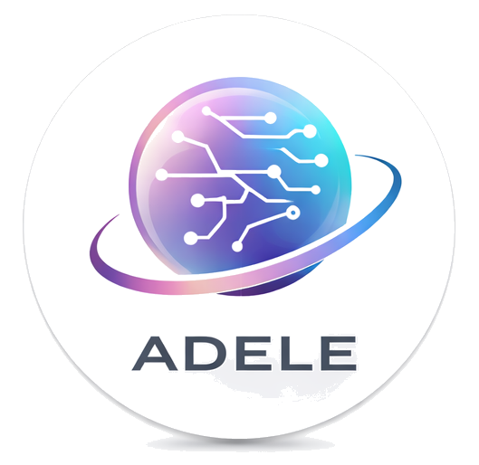

# ADELE - AI-Powered No-Code Application Builder

<p align="center">
  
</p>

<p align="center">
  <strong>Build full-stack applications from natural language descriptions</strong>
</p>

<p align="center">
  <a href="#features">Features</a> •
  <a href="#architecture">Architecture</a> •
  <a href="#getting-started">Getting Started</a> •
  <a href="#usage">Usage</a> •
  <a href="#api">API</a>
</p>

---

## Overview

ADELE (Autonomous Development Environment for Learning and Execution) is a comprehensive no-code application builder that leverages a multi-agent AI system to transform natural language descriptions into fully functional applications. Inspired by platforms like Manus.im and Lovable, ADELE goes beyond simple web development to support entire enterprise-grade applications including UI, backend, database, and security components.

## Features

### Multi-Agent AI System

ADELE employs a sophisticated multi-agent architecture based on the OpenManus framework:

| Agent | Responsibility |
|-------|----------------|
| **Coordinator** | Breaks down high-level requests into subtasks and orchestrates agent collaboration |
| **Research** | Gathers information from web, documentation, and best practices |
| **Coder** | Generates frontend (React/TypeScript) and backend (FastAPI/Python) code |
| **Database** | Designs schemas, manages migrations, and optimizes queries |
| **Security** | Implements authentication, authorization, and validation |
| **Reporter** | Generates documentation, user guides, and deployment instructions |
| **Browser** | Tests UI components and handles web automation |

### Apple-Style Interface

The user interface follows Apple's design philosophy with a clean, minimalist aesthetic featuring subtle gradients, smooth animations, and intuitive interactions. The interface supports both light and dark themes.

### Voice Control

Full hands-free operation with voice commands supporting both English and Japanese:
- Natural language code generation
- Navigation commands
- Project management
- Conversational coding interface

### Real-Time Collaboration

Work together with team members in real-time:
- Live cursor presence
- Collaborative editing
- Team chat within projects
- Session management

### Version Control

Visual git-like version control system:
- Commit history visualization
- File diff viewer
- One-click rollback
- Branch management

### Template Library

Pre-built application templates for rapid development across 20+ categories:
- **Business**: CRM, E-Commerce, SaaS, Marketplace, Inventory
- **Healthcare**: Patient Management, Telemedicine
- **Finance**: Finance Tracker, Invoice & Billing, Loan Management
- **Education**: LMS, School Management, Online Exam Platform
- **Real Estate**: Property Listing, Property Management
- **HR**: HRMS, Recruitment Portal
- **Logistics**: Fleet Management, Delivery Platform
- **Restaurant**: POS System, Food Ordering
- **Fitness**: Gym Management, Fitness Tracker
- **Legal**: Law Firm Management, Contract Management
- **Non-Profit**: Donation Platform, Volunteer Management

### TTS Engine Configuration

Configurable Text-to-Speech with multiple provider support:
- Google Cloud TTS
- ElevenLabs
- Azure TTS
- Amazon Polly
- OpenAI TTS

### Biometric Registration

Advanced user identification features:
- Voice sample registration with quality scoring
- Face photo registration with detection
- Biometric login option
- Personalized proactive communication

### Stripe Payment Integration

Full subscription billing system:
- **Free Plan**: 3 projects, basic AI agents, community templates
- **Pro Plan** ($29/mo): Unlimited projects, all AI agents, premium templates, team collaboration
- **Enterprise Plan** ($99/mo): Everything in Pro, unlimited team members, SSO, dedicated support
- Admin panel for Stripe API key management
- Secure checkout flow via Stripe
- Customer portal for billing management

### Onboarding Wizard

Guided first-time user experience:
- Step-by-step interactive tour
- Spotlight overlays for key features
- Progress tracking and skip functionality
- Personalized welcome experience

### MCP Server Integration

Model Context Protocol support for external tools:
- GitHub, Slack, and database MCP servers
- Tool discovery and invocation API
- Connection status monitoring

### Usage Analytics Dashboard

Admin-only analytics for platform insights:
- User activity metrics
- Template usage tracking
- Agent performance analytics
- Export reports (JSON/CSV)

### Tool Connections

Integrate with your favorite tools and services:
- **Version Control**: GitHub, GitLab, Bitbucket
- **Communication**: Slack, Discord, Microsoft Teams
- **Databases**: PostgreSQL, MySQL, MongoDB, Redis
- **Cloud Storage**: AWS S3, Google Cloud Storage, Azure Blob
- **Deployment**: Vercel, Netlify, Railway, Heroku, Docker Hub
- **AI Services**: OpenAI, Anthropic, Google AI
- **Business Tools**: Stripe, Twilio, SendGrid
- **Productivity**: Notion, Linear, Jira, Figma
- **Custom API Integration**

## Architecture

```
┌─────────────────────────────────────────────────────────────────┐
│                        Web Interface                             │
│  ┌──────────────┐  ┌──────────────┐  ┌──────────────┐          │
│  │   Chat UI    │  │ Live Preview │  │  Code Editor │          │
│  └──────────────┘  └──────────────┘  └──────────────┘          │
└─────────────────────────────────────────────────────────────────┘
                              │
                              ▼
┌─────────────────────────────────────────────────────────────────┐
│                    Agent Orchestration Layer                     │
│  ┌────────────────────────────────────────────────────────────┐ │
│  │                    Coordinator Agent                        │ │
│  └────────────────────────────────────────────────────────────┘ │
│       │          │          │          │          │             │
│       ▼          ▼          ▼          ▼          ▼             │
│  ┌────────┐ ┌────────┐ ┌────────┐ ┌────────┐ ┌────────┐       │
│  │Research│ │ Coder  │ │Database│ │Security│ │Reporter│       │
│  └────────┘ └────────┘ └────────┘ └────────┘ └────────┘       │
└─────────────────────────────────────────────────────────────────┘
                              │
                              ▼
┌─────────────────────────────────────────────────────────────────┐
│                    Code Generation Engine                        │
│  ┌──────────────┐  ┌──────────────┐  ┌──────────────┐          │
│  │   Frontend   │  │   Backend    │  │   Database   │          │
│  │  Templates   │  │  Templates   │  │   Schemas    │          │
│  └──────────────┘  └──────────────┘  └──────────────┘          │
└─────────────────────────────────────────────────────────────────┘
                              │
                              ▼
┌─────────────────────────────────────────────────────────────────┐
│                    Deployment Pipeline                           │
│  ┌──────────────┐  ┌──────────────┐  ┌──────────────┐          │
│  │    Docker    │  │    Cloud     │  │   Download   │          │
│  │   Container  │  │  Deployment  │  │    Export    │          │
│  └──────────────┘  └──────────────┘  └──────────────┘          │
└─────────────────────────────────────────────────────────────────┘
```

## Tech Stack

### Frontend
- **React 19** with TypeScript
- **Tailwind CSS 4** for styling
- **Framer Motion** for animations
- **tRPC** for type-safe API calls
- **shadcn/ui** component library

### Backend
- **Express.js** with TypeScript
- **tRPC** for API layer
- **Drizzle ORM** for database operations
- **MySQL/TiDB** for data storage

### AI/ML
- **OpenAI GPT-4** for natural language processing
- **Whisper API** for voice transcription
- **Custom agent framework** based on OpenManus

## Getting Started

### Prerequisites

- Node.js 22+
- pnpm 10+
- MySQL/TiDB database

### Installation

1. Clone the repository:
```bash
git clone https://github.com/drsadivural/adele.git
cd adele
```

2. Install dependencies:
```bash
pnpm install
```

3. Set up environment variables:
```bash
cp .env.example .env
# Edit .env with your configuration
```

4. Push database schema:
```bash
pnpm db:push
```

5. Start the development server:
```bash
pnpm dev
```

6. Open http://localhost:3000 in your browser

## Usage

### Creating a New Project

1. Sign in to ADELE
2. Click "New Project" on the dashboard
3. Enter a project name and select the application type
4. Describe your application in natural language
5. Watch as ADELE's agents build your application

### Voice Commands

Press `Ctrl + Space` to activate voice control, then try:

- "Create a login page"
- "Add a navigation menu"
- "Generate an API endpoint for users"
- "Deploy the application"
- "Save a new version"

### Using Templates

1. Navigate to the Templates page
2. Browse templates by category
3. Click "Use Template" to start a new project
4. Customize as needed

## API Reference

ADELE exposes a tRPC API for all operations:

### Project Routes
- `project.create` - Create a new project
- `project.list` - List user's projects
- `project.get` - Get project details
- `project.delete` - Delete a project

### Chat Routes
- `chat.sendMessage` - Send a message to agents
- `chat.getMessages` - Get chat history

### Version Routes
- `version.create` - Create a new version
- `version.list` - List project versions
- `version.rollback` - Rollback to a version

### Voice Routes
- `voice.transcribe` - Transcribe audio
- `voice.processCommand` - Process voice command

### TTS Routes
- `tts.getProviders` - Get available TTS providers
- `tts.synthesize` - Synthesize speech from text
- `tts.setDefault` - Set default TTS provider

### Biometric Routes
- `biometrics.registerVoice` - Register voice sample
- `biometrics.registerFace` - Register face photo
- `biometrics.verify` - Verify biometric data

### Tool Connection Routes
- `toolConnections.list` - List user's connections
- `toolConnections.connect` - Connect a new tool
- `toolConnections.disconnect` - Disconnect a tool
- `toolConnections.test` - Test connection

### User Settings Routes
- `userSettings.get` - Get user settings
- `userSettings.update` - Update user settings

## Contributing

Contributions are welcome! Please read our contributing guidelines before submitting PRs.

## License

MIT License - see LICENSE file for details.

## Acknowledgments

- Inspired by [Manus.im](https://manus.im) and [Lovable](https://lovable.dev)
- Built on the [OpenManus](https://github.com/FoundationAgents/OpenManus) agent framework
- UI components from [shadcn/ui](https://ui.shadcn.com)

---

<p align="center">
  Made with ❤️ by the ADELE Team
</p>
